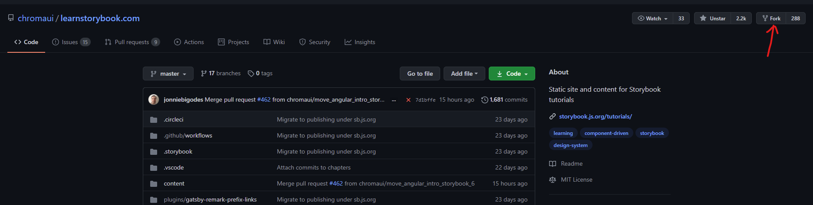
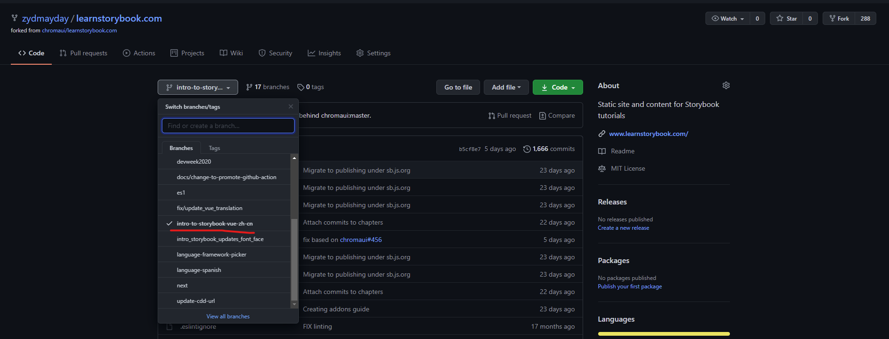

[learnstorybook.com](https://github.com/chromaui/learnstorybook.com)に貢献しました。  
learnstorybookは何かと言いますと、[Storybook](https://storybook.js.org/tutorials/)に関するチュートリアルです。

私が出した[PR](https://github.com/chromaui/learnstorybook.com/pull/436)を先に貼ります。

## 背景

今兼任しているチームで新しい機能を作ろうとしています。  
フロントエンドはVueを利用しています。  
あるチームメンバーがStorybookを使おうよと言い出しました。

そもそもStorybookは何なのかすらわからない私は、
ちょっと興味を持ってネットで検索しました。  
ところでlearnstorybookを見つけた。

（自分が知らない技術はいっぱいあるので、全部自分でカバーすることが基本的に不可能ですし、
周りの人の意見やアドバイスを吸収することが大事だなと感じました。
自分が知っていることをどんどん言い出すことも大事。
チームの知識（財産）になるからです。　→　あまり多く言いすぎるとよくないかも。。。

## なぜ貢献したいのか？

正直に言って今子育ての仕事もあるし、
新しい機能を作っているし、
なかなか時間がないのが事実です。

しかし、ずっとコミュニティに貢献したいと思い続けているので、
今回はこういう貢献しやすい形を選びました。

理由：

- 自分の知識を活用できる：中国語に翻訳するなので
- 英語の勉強になれる
- Storybookに対する理解が深められる
- 社会的貢献？

## 実際にやったこと

### Fork

まず[大本](https://github.com/chromaui/learnstorybook.com)からソースコードをフォークする。  
フォークされた[レポジトリ](https://github.com/zydmayday/learnstorybook.com?organization=zydmayday&organization=zydmayday)。

### Branch

自分のレポジトリで修正用のブランチを切る。

例えば私の場合に`intro-to-stroybook-vue-zh-cn`というブランチを切りました。  
修正は全部自分のブランチで行います。

### Push

自分で修正したい内容を修正して、`git push`します。

Push後、GitHubで確認すると、新しい`Pull Request(PR)`を作成することができます。

PRを作成したら、大本のrepoと紐づけて、大本のrepoの管理者がもしこの修正がほしい場合にマージしてくれます。

P.S. ちょっと今回自分の手順が間違ってました。  
微修正などはPRだけでいいですけど、
今回の大きな修正ならばまずissueが必要らしい。

普通にマージされるまでには元のプロジェクト関係者といろいろコミュニケーションしないといけないと思います。  
それも楽しみの一つである。

### Sync

もし自分のForkと大本と同期したい場合に、
この[doc](https://docs.github.com/en/github/collaborating-with-issues-and-pull-requests/syncing-a-fork)を参考してください。

## learnstorybookだけの話

### Local Server

翻訳だけだと言ってもローカルで翻訳された文章を確認するために、  
ローカルのセットアップが必要です。

`yarn`でローカルサーバーを立ち上げているので、
事前に自分のPCに`yarn`をインストールする必要があります。

### 差し込み

**自分から問題発見**  
自分が翻訳中にもいくつか問題を見つけて、それをなるはや[報告](https://github.com/chromaui/learnstorybook.com/pull/436#issuecomment-785870527)していきましょう。

**向こうからのリクエスト**  
修正の期間が長い場合に、
途中で大本のソースが変わる場合があります。  
私の場合に、スタートから完成まで大体一ヶ月半をかかってました。  
途中で大本のソースが二回更新され、私もその更新を対応しないといけないことになりました。

これは面倒くさいと思う方はいると思うが、
個人的にはこれはプロジェクトが活発している証だと思って、逆に貢献する甲斐があるのではないかと思いますね。

## 最後

仕事上がりに気分転換でこういった貢献をしていただくこともいいですし、
かっつり何かのプロジェクトを改善したく貢献していただくこともいいですし。

最初は確かに「何かをやらかしたらまずい！」とビビるかもしれませんが、
意外とコミュニティの方が親切なので、
とりあえず第一歩を踏み出しましょう！
