# 前書き

最近は【Code: The Hidden Language of Computer Hardware and Software】という本を読んで、
結構面白いと思って、この中に書いた Adder を作るプロセスをシェアしたいと思います。

## 論理回路（Logic Gate）

### NOT Gate

| x   | result |
| --- | ------ |
| 0   | 1      |
| 1   | 0      |

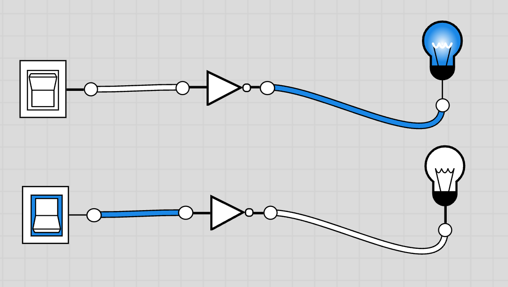

### OR Gate

| x   | y   | result |
| --- | --- | ------ |
| 0   | 0   | 0      |
| 0   | 1   | 1      |
| 1   | 0   | 1      |
| 1   | 1   | 1      |

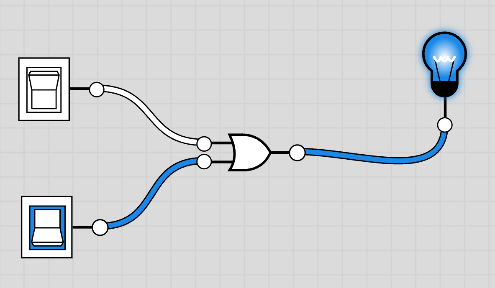

### AND Gate

| x   | y   | result |
| --- | --- | ------ |
| 0   | 0   | 0      |
| 0   | 1   | 0      |
| 1   | 0   | 0      |
| 1   | 1   | 1      |

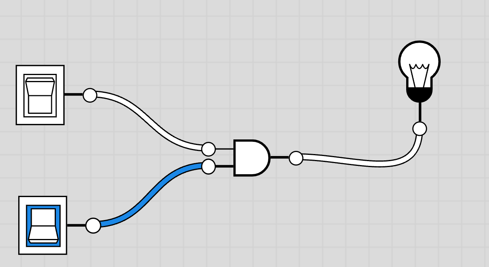

### NAND Gate 　

`AND Gate`の真逆です。

NAND は AND と NOT で作っています。

| x   | y   | result |
| --- | --- | ------ |
| 0   | 0   | 1      |
| 0   | 1   | 1      |
| 1   | 0   | 1      |
| 1   | 1   | 0      |

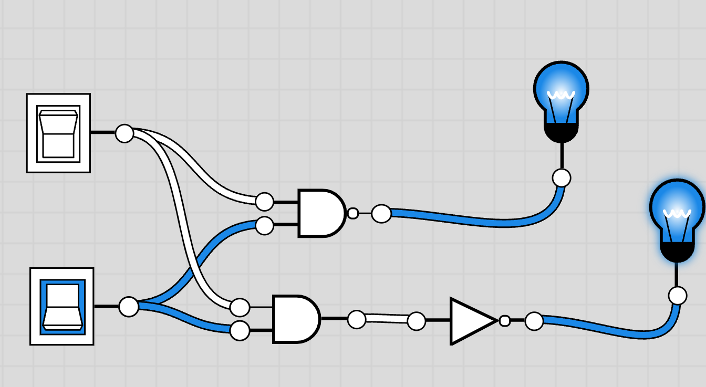

## 半加算器

今回は A と B を加算するプロセスを説明します。  
A と B は 1-bit です。

たぶん気づいたと思いますが、
A と B の加算結果が、

| A   | B   | sum |
| --- | --- | --- |
| 0   | 0   | 0   |
| 0   | 1   | 1   |
| 1   | 0   | 1   |
| 1   | 1   | 10  |

になります。

しかし、今作成しようとする加算器は 1-bit しか対応していないので、
A と B 両方が 1 になった場合に、
計算結果が Overflow します。

この状況を対応するため、
A と B の加算結果を sum 以外に、carry も保存するべきです。

| A   | B   | sum | carry |
| --- | --- | --- | ----- |
| 0   | 0   | 0   | 0     |
| 0   | 1   | 1   | 0     |
| 1   | 0   | 1   | 0     |
| 1   | 1   | 0   | 1     |

### Carry

carry の部分について簡単で、
前に話した`AND Gate`とぴったりですね。
そのまま利用できます。

### Sum と XOR

Sum の部分について、既存の論理回路ではそのまま利用できなさそうですね。

`OR Gate`と`NAND Gate`の場合に、A と B のどっちが 1 の場合に、結果が 1 になる、  
また、A と B 両方が 0 の場合に、`NAND Gate`が 1 になり、  
逆に、A と B 両方が 1 の場合に、`OR date`が 1 になります。

| A   | B   | OR  | NAND |
| --- | --- | --- | ---- |
| 0   | 0   | 0   | 1    |
| 0   | 1   | 1   | 1    |
| 1   | 0   | 1   | 1    |
| 1   | 1   | 1   | 0    |

じゃあ、A と B が`OR Gate`と`NAND Gate`を通った結果をまた`AND Gate`でもう一度計算すると、
期待通りになりそうですね。

| A   | B   | OR  | NAND |
| --- | --- | --- | ---- |
| 0   | 0   | 0   | 1    |
| 0   | 1   | 1   | 1    |
| 1   | 0   | 1   | 1    |
| 1   | 1   | 1   | 0    |

| OR  | NAND | AND |
| --- | ---- | --- |
| 0   | 1    | 0   |
| 1   | 1    | 1   |
| 1   | 1    | 1   |
| 1   | 0    | 0   |

上記のような計算ロジックを`XOR`と言います。

| XOR | 0   | 1   |
| --- | --- | --- |
| 0   | 0   | 1   |
| 1   | 1   | 0   |

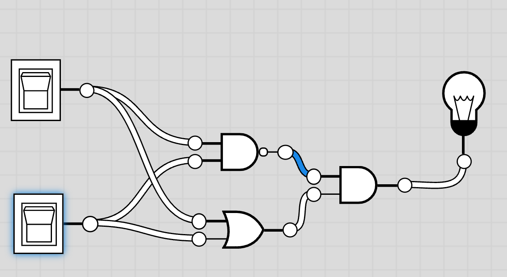
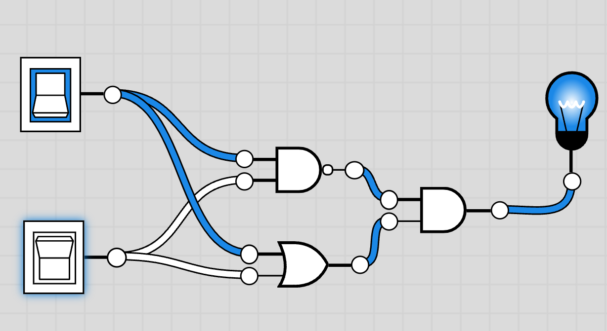
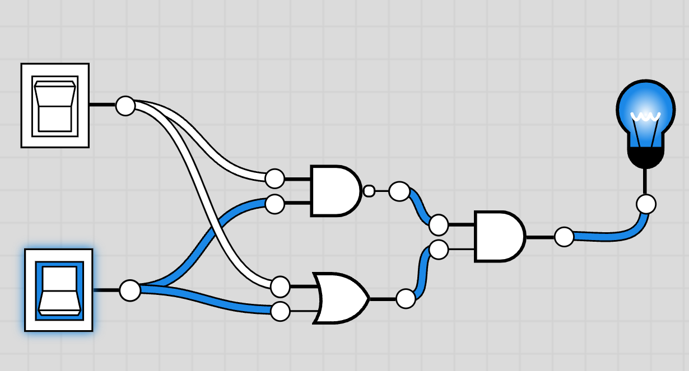
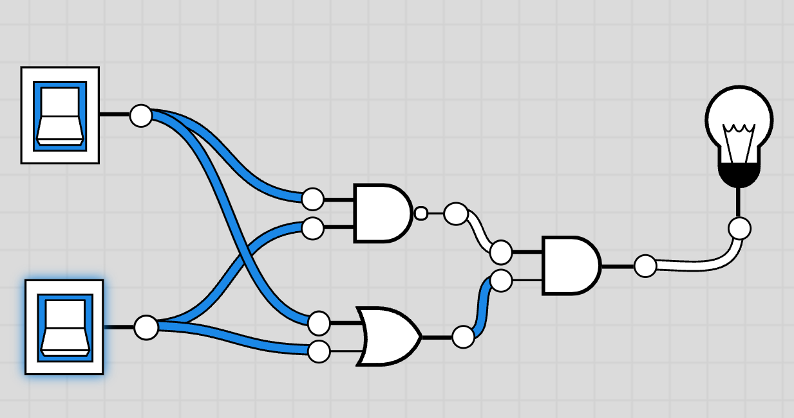

XOR も自分の記号があります。

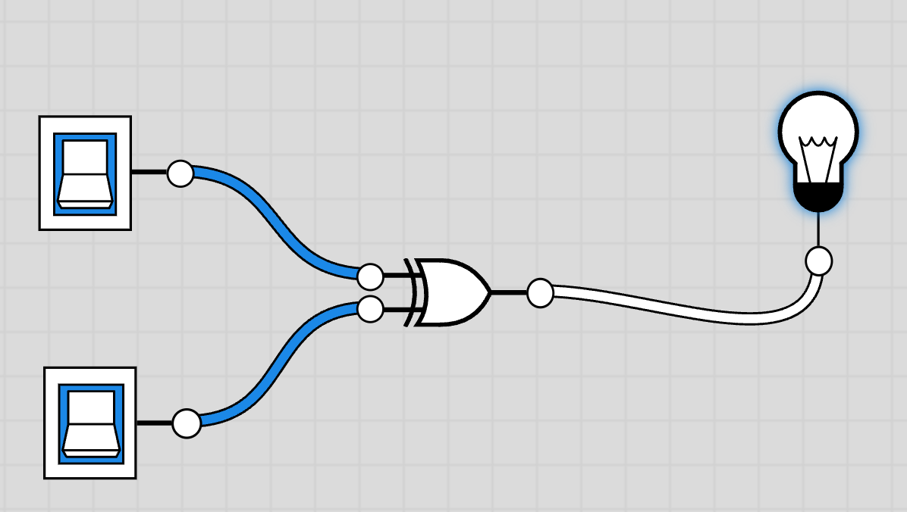

ここまでに行くと、`Logic Gate`を使って半加算器を実現できました。

上の電球が Sum、下の電球が Carry。

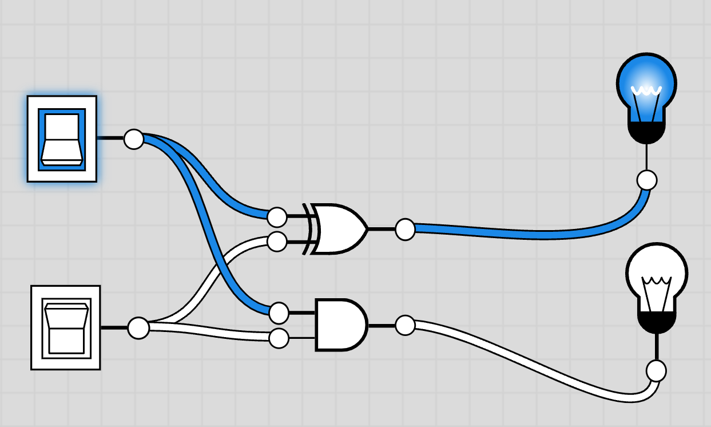

## 全加算器

半加算器では、A と B の計算で桁上げが発生する場合に、桁上げを上位桁に利用できます。  
こういう風に繰り返しますと、
1-bit ではなく、
何 bit でも、最下位から最上位まで計算できます。

結論で言うと、全加算器が 1-bit の数値を計算する物ですが、  
複数の全加算器を並べると、数 bit の数値を計算することができます。
例えば、8 個の全加算器を利用すると、8-bit の数値を計算でき、  
最大 2^8-1=255 まで計算できます。

全加算器の INPUT が A と B 以外に、下位桁からの Carry も INPUT として利用します。

まず最終的なイメージ（実現したいこと）をここに書きます。

| A   | B   | C:input | sum(final) | C(final) |
| --- | --- | ------- | ---------- | -------- |
| 0   | 0   | 0       | 0          | 0        |
| 0   | 1   | 0       | 1          | 0        |
| 1   | 0   | 0       | 1          | 0        |
| 1   | 1   | 0       | 0          | 1        |
| 0   | 0   | 1       | 1          | 0        |
| 0   | 1   | 1       | 0          | 1        |
| 1   | 0   | 1       | 0          | 1        |
| 1   | 1   | 1       | 1          | 1        |

### sum(final)

| A   | B   | sum(A+B) | C:input | sum(final) | C(final) |
| --- | --- | -------- | ------- | ---------- | -------- |
| 0   | 0   | **0**    | **0**   | **0**      | 0        |
| 0   | 1   | **1**    | **0**   | **1**      | 0        |
| 1   | 0   | **1**    | **0**   | **1**      | 0        |
| 1   | 1   | **0**    | **0**   | **0**      | 1        |
| 0   | 0   | **0**    | **1**   | **1**      | 0        |
| 0   | 1   | **1**    | **1**   | **0**      | 1        |
| 1   | 0   | **1**    | **1**   | **0**      | 1        |
| 1   | 1   | **0**    | **1**   | **1**      | 1        |

| sum(A+B) | C:input | sum(final) |
| -------- | ------- | ---------- |
| 0        | 0       | 0          |
| 1        | 0       | 1          |
| 0        | 1       | 1          |
| 1        | 1       | 0          |

重複な部分をいったん削除します。

なんか見覚えがあるのではないですか？

**NOTE A+B は半加算器で計算しています。**

そうです、A と B の計算結果 + C:input がまさに半加算器で、最終的な Sum を計算できます。

つまり、

```
半加算器2(半加算器1(A, B), C:input) = sum(final), 半加算器2 C:output
```

| A   | B   | sum(A+B) | C:input | sum(final) | 半加算器 2 C:output | C(final) |
| --- | --- | -------- | ------- | ---------- | ------------------- | -------- |
| 0   | 0   | **0**    | **0**   | **0**      | **0**               | 0        |
| 0   | 1   | **1**    | **0**   | **1**      | **0**               | 0        |
| 1   | 0   | **1**    | **0**   | **1**      | **0**               | 0        |
| 1   | 1   | **0**    | **0**   | **0**      | **0**               | 1        |
| 0   | 0   | **0**    | **1**   | **1**      | **0**               | 0        |
| 0   | 1   | **1**    | **1**   | **0**      | **1**               | 1        |
| 1   | 0   | **1**    | **1**   | **0**      | **1**               | 1        |
| 1   | 1   | **0**    | **1**   | **1**      | **0**               | 1        |

この半加算器の Carry（output）の部分も上記のように埋めます。

### C:output

A と B が半加算器 1 での計算結果を補足します。

| A     | B     | sum(A+B) | 半加算器 1 C:out | C:in | sum(final) | 半加算器 2 C:out | C(final) |
| ----- | ----- | -------- | ---------------- | ---- | ---------- | ---------------- | -------- |
| **0** | **0** | **0**    | **0**            | 0    | 0          | 0                | 0        |
| **0** | **1** | **1**    | **0**            | 0    | 1          | 0                | 0        |
| **1** | **0** | **1**    | **0**            | 0    | 1          | 0                | 0        |
| **1** | **1** | **0**    | **1**            | 0    | 0          | 0                | 1        |
| **0** | **0** | **0**    | **0**            | 1    | 1          | 0                | 0        |
| **0** | **1** | **1**    | **0**            | 1    | 0          | 1                | 1        |
| **1** | **0** | **1**    | **0**            | 1    | 0          | 1                | 1        |
| **1** | **1** | **0**    | **1**            | 1    | 1          | 0                | 1        |

ここまで行くと、
最後に計算したいことが`C:out`です。

どのデータを使って`C:out`を計算できるでしょうか？

| 半加算器 1 C:out | 半加算器 2 C:out | C(final) |
| ---------------- | ---------------- | -------- |
| 0                | 0                | 0        |
| 0                | 0                | 0        |
| 0                | 0                | 0        |
| 1                | 0                | 1        |
| 0                | 0                | 0        |
| 0                | 1                | 1        |
| 0                | 1                | 1        |
| 1                | 0                | 1        |

重複な部分を削除します。

| 半加算器 1 C:out | 半加算器 2 C:out | C(final) |
| ---------------- | ---------------- | -------- |
| 0                | 0                | 0        |
| 1                | 0                | 1        |
| 0                | 1                | 1        |

`半加算器 1 C:out`と`半加算器 2 C:out`が同時に 1 になるケースがないですが、
これを見ると、`OR Gate`が使えそうと思いますね。

そうです。
二つの半加算器の`C:out`をまた`OR Gate`の二つの Input として使って、
`OR Gate`の Output が最終的の`C(final)`になります。

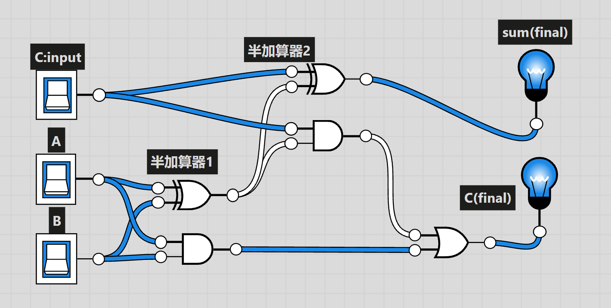
