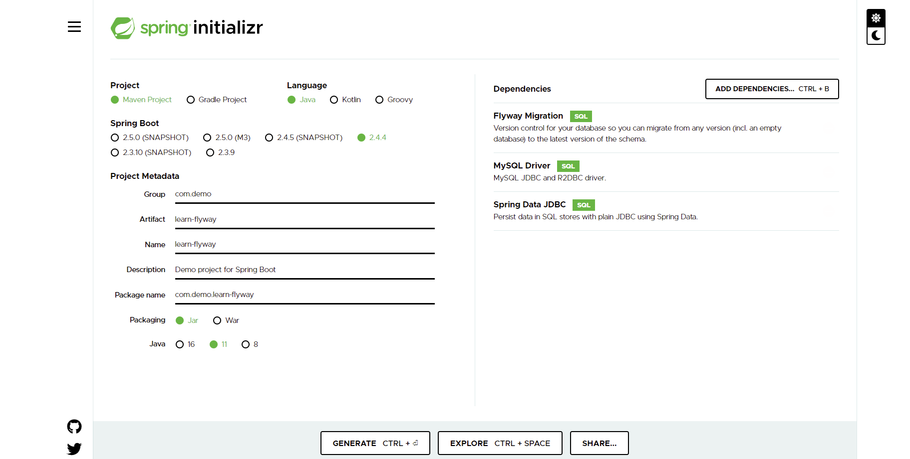

# flywayキャッチアップメモ

複数人で同じプロジェクトを開発するときに、DB上のテーブル構造が変わった場合に、
それぞれの開発者が自分のローカルのDBを持っている場合に、
各開発者はご自身で何かしらのSQLを流して適用しないといけないです。

開発者同士はお互いに情報を共有し、
もしDBへの変更があれば、
手動でもしくはバッチジョブなどを組んでDBへのスクリプト適用を行う必要があります。

その作業自体は頻繁に発生すると、
かなり手間がかかるし、
またニューマンミスによる別の問題が発生する可能性もあります。

このようなことを防止するために、今回はflywayというフレームワークをキャッチアップし、
自分が勉強したことをメモ書きで共有したいと思います。

## Spring initializr

<https://start.spring.io/>



- Flyway Migration
- MySQL Driver
- Spring Data JDBC

`GENERATE`を押下してzipファイルをダウンロードします。

## Import to IntelliJ

ItelliJを起動し、File > Openで上記解凍したフォルダーを選択すればプロジェクトをインポートできると思います。

## ディレクトリ構造

```tree
.
├── HELP.md
├── learn-flyway.iml
├── mvnw
├── mvnw.cmd
├── pom.xml
└── src
    ├── main
    │   ├── java
    │   │   └── com
    │   │       └── demo
    │   │           └── learnflyway
    │   │               └── LearnFlywayApplication.java
    │   └── resources
    │       ├── application.properties -> mysqlの情報を入れる
    │       └── db
    │           └── migration -> ここにSQLを書く
    └── test
        └── java
            └── com
                └── demo
                    └── learnflyway
                        └── LearnFlywayApplicationTests.java
```

## MySQL

### Download

<https://dev.mysql.com/downloads/installer/>

### Add new user and grant privileges

```shell
$ mysql -u root
mysql> create user 'flyway'@'localhost' identified by 'flyway';
mysql> grant all privileges on * . * to 'flyway'@'localhost';
```

### Add new Database

```shell
$ mysql -u flyway -p
# input your password here
mysql> create database flywaydemo;
mysql> show databases;
```

## IntelliJ with MySQL

View > Tool Windows > Database


プラスボタン > Data Source > MySQLを選択します。


画像のように設定します。

| 項目  | 値  |
|---|---|
| Name  | （任意）flywaydemo@localhost  |
| Host  | localhost  |
| User  | flyway  |
| Password  | flyway  |
| Database  | flywaydemo  |
| URL  | 自動生成される  |


設定後に、`Test Connection`をクリックして接続できるかどうかを確認します。

## Add first SQL

`src/main/resources/db/migration`以下にファイルを作成します。

```sql:V21.04.14.001__Init.sql
create table user
(
    id        bigint unsigned primary key auto_increment,
    name      varchar(255) not null,
    password  varchar(255) not null,
    create_at datetime default current_timestamp
)
```

`Ctrl + Enter`を押下し、もしくは緑の三角を押すことでSQLをそのまま実行できます。


画像のように、右側にもflywaydemo > tables > userというテーブルが出てきました。

### 確認

念のため確認します。


```sql
select * from user
```

userテーブルがあるけどまだデータがないですね。

### 削除

とりあえず作成したuserテーブルを削除します。

```sql
drop table user
```

## application.properties

```properties:src/main/resources/application.properties
spring.datasource.url=jdbc:mysql://localhost:3306/flywaydemo
spring.datasource.username=flyway
spring.datasource.password=flyway
```

上記のコードを`application.properties`に追加します。

## Run Springboot

もろもろ準備ができたspring bootを起動します。

実行後のログを添付します。

```log
2021-04-14 17:12:24.029  INFO 16704 --- [           main] .s.d.r.c.RepositoryConfigurationDelegate : Finished Spring Data repository scanning in 3 ms. Found 0 JDBC repository interfaces.
2021-04-14 17:12:24.234  INFO 16704 --- [           main] o.f.c.internal.license.VersionPrinter    : Flyway Community Edition 7.1.1 by Redgate
2021-04-14 17:12:24.237  INFO 16704 --- [           main] com.zaxxer.hikari.HikariDataSource       : HikariPool-1 - Starting...
2021-04-14 17:12:24.332  INFO 16704 --- [           main] com.zaxxer.hikari.HikariDataSource       : HikariPool-1 - Start completed.
2021-04-14 17:12:24.355  INFO 16704 --- [           main] o.f.c.i.database.base.DatabaseType       : Database: jdbc:mysql://localhost:3306/flywaydemo (MySQL 5.7)
2021-04-14 17:12:24.379  INFO 16704 --- [           main] o.f.core.internal.command.DbValidate     : Successfully validated 1 migration (execution time 00:00.012s)
2021-04-14 17:12:24.387  INFO 16704 --- [           main] o.f.c.i.s.JdbcTableSchemaHistory         : Creating Schema History table `flywaydemo`.`flyway_schema_history` ...
2021-04-14 17:12:24.835  INFO 16704 --- [           main] o.f.core.internal.command.DbMigrate      : Current version of schema `flywaydemo`: << Empty Schema >>
2021-04-14 17:12:24.838  INFO 16704 --- [           main] o.f.core.internal.command.DbMigrate      : Migrating schema `flywaydemo` to version "21.04.14.001 - Init"
2021-04-14 17:12:25.200  INFO 16704 --- [           main] o.f.core.internal.command.DbMigrate      : Successfully applied 1 migration to schema `flywaydemo` (execution time 00:00.369s)
2021-04-14 17:12:25.288  INFO 16704 --- [           main] c.d.learnflyway.LearnFlywayApplication   : Started LearnFlywayApplication in 1.702 seconds (JVM running for 2.425)
2021-04-14 17:12:25.292  INFO 16704 --- [extShutdownHook] com.zaxxer.hikari.HikariDataSource       : HikariPool-1 - Shutdown initiated...
2021-04-14 17:12:25.301  INFO 16704 --- [extShutdownHook] com.zaxxer.hikari.HikariDataSource       : HikariPool-1 - Shutdown completed.
```

大体このような感じで実行できます。

### テーブル確認


spring bootを実行後に、右側のDatabaseを確認し、
flywaydemoをリフレッシュ（↑のフレッシュアイコン）すると、二つのテーブルが作成されました。

`user`はもちろん私たちが定義したテーブルのはずで、
`flyway_schema_history`は一体何者でしょうか？

### flyway_schema_history

```sql
select * from flyway_schema_history
```

| 項目  | 値  |
|---|---|
| installed_rank  | 1  |
| version  | 21.04.14.001  |
| description  | Init  |
| type  | SQL  |
| script  | V21.04.14.001__Init.sql  |
| checksum  | 1280597246  |

`V21.04.14.001__Init.sql`が実行された痕跡が残されていますね。

なぜこれがあるかと言いますと、
flywayはSpringbootが実行するたびにとともに実行される機能なので、
二回目Springbootを実行するときに`flyway_schema_histoiry`のおかげでuserテーブルを重複作成しないようにコントロールできます。

## Add Second SQL

```sql:V21.04.14.002__InsertUserData.sql
insert into user (name, password)
values ('admin', 'admin');
insert into user (name, password)
values ('user', 'user');
```

追加後もう一度Spring bootを実行します。

```log
2021-04-14 17:44:01.218  INFO 2632 --- [           main] o.f.core.internal.command.DbValidate     : Successfully validated 2 migrations (execution time 00:00.020s)
2021-04-14 17:44:01.227  INFO 2632 --- [           main] o.f.core.internal.command.DbMigrate      : Current version of schema `flywaydemo`: 21.04.14.001
2021-04-14 17:44:01.234  INFO 2632 --- [           main] o.f.core.internal.command.DbMigrate      : Migrating schema `flywaydemo` to version "21.04.14.002 - InsertUserData"
```

Spring bootの実行ログを見ると、
今のバージョンは`21.04.14.001`、また次のバージョン`21.04.14.002 - InsertUserData`が適用していないので適用しますというふうにわかりますね。

### user table 確認


右側のuserテーブルをダブルクリックして、user内のデータを確認することができます。

確かに二行のデータがインサートされていますね。

## Add Third SQL

今回はアプリケーションの仕様が変更されたのでそれに従ってテーブルも変更します。

修正点

- nameを一意にする
- emailというカラムを追加する

```sql:V21.04.15.001__AlterUserTable.sql
alter table user
    add column email varchar(255),
    add unique (name);
```

Spring bootをもう一度実行するとuserテーブルは期待通りになりましたね。

## 最後

これでDBのテーブルを手動でメンテナンスしなくても楽に開発できるようになりました！

```diff:修正後の構造
  .
  ├── HELP.md
  ├── learn-flyway.iml
  ├── mvnw
  ├── mvnw.cmd
  ├── pom.xml
  ├── src
  │   ├── main
  │   │   ├── java
  │   │   │   └── com
  │   │   │       └── demo
  │   │   │           └── learnflyway
  │   │   │               └── LearnFlywayApplication.java
  │   │   └── resources
  │   │       ├── application.properties
  │   │       └── db
  │   │           └── migration
+ │   │               ├── V21.04.14.001__Init.sql
+ │   │               ├── V21.04.14.002__InsertUserData.sql
+ │   │               └── V21.04.15.001__AlterUserTable.sql
  │   └── test
  │       └── java
  │           └── com
  │               └── demo
  │                   └── learnflyway
  │                       └── LearnFlywayApplicationTests.java
```

## Link

- <https://docs.spring.io/spring-boot/docs/current/reference/html/appendix-application-properties.html#spring.datasource.url>
- <https://www.digitalocean.com/community/tutorials/how-to-create-a-new-user-and-grant-permissions-in-mysql>
- <https://www.baeldung.com/database-migrations-with-flyway>
- <https://flywaydb.org/documentation/usage/plugins/springboot>