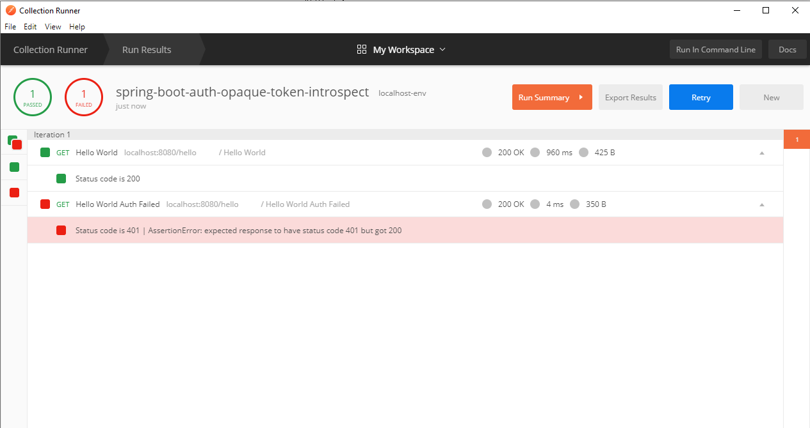
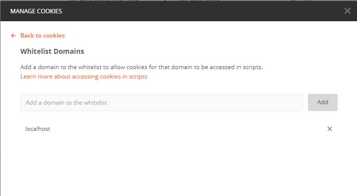

以前に[Springを使ってトークンをイントロスぺクトしてみる](https://qiita.com/zhang_yid/items/85dad87dc00955842317)という記事を書きました。
これにより自分が書いたAPIをサードパーティーの認証サーバーで保護できます。

また、postmanを使って認証が効いてるかどうかを検証しました。
でもpostmanを使う時にある問題が発生しました、今回の記事はその問題と解決方法について話します。

## 1 cookiesによる問題

postmanではリクエストするたびにクッキーが生成されます。
これで該当のリクエストに対するキャッシュが生成されます。

https://stackoverflow.com/questions/49509992/how-to-disable-cookies-in-postman-application

ネッドで調査したのですが、このようなクッキーをディスエーブルする設定がそもそもpostmanにはないらしいです。
ちょっとショックでした。

普段ならばクッキーがあっても問題ないし、むしろいろいろキャッシュしてくれて速度改善も期待できます。

しかし、今回は認証のエンドポイントをテストしたいので、クッキーが残り続けると認証の`失敗する`ケースがテストできなくなります。

### 1.1 postmanでテストを書く


こういうふうに成功する場合のテストケースを書きました。
Authorizationタブに正しいトークン情報を入れています。
実行すると該当のテストがパスしました。


同じくAuthorization情報を提供しない場合のテストを書きます。
リクエストを送信すると`Test Results`のところに該当のテストがパスしたことを確認しました。

### 1.2 Collection Runnerで実行してみる

ここまではうれしいですが、



コレクションランナーで複数テストを実行してしまうと、
もともの401のテストがなんと200になりました！

## 2 複数テスト実行失敗の原因

最初はいろいろ調査したけれど、
クッキーが存在することでもともと認証失敗するはずのリクエストが成功するようになったことがわかりました。

もう一度失敗するテストを実行してもずっと200が返されます。


`MANAGE COOKIES`ダイアログで確認すると、localhostドメインに`JSESSIONID`というクッキーが存在しました。

このクッキーを削除してもう一度認証失敗するテストを実行すると、401が返されました。
やはりクッキーが原因ですね。

## 3 問題解消

今回はpostmanのスクリプトで自動でクッキーをクリアします。

### 3.1 スクリプトを有効にする

デフォルトではスクリプトを使ってクッキーを操作できないのでまず有効にします。




私は`localhost`を利用しているのでlocalhostを`whitelist domains`に追加します。

### 3.2 スクリプトを書く

```javascript
const jar = pm.cookies.jar();
jar.clear(pm.request.url.getRaw(), error => {
    console.log(error);
})
```


`Pre-request Script`にクッキーをクリアする。
これは文字通りリクエストする前に実行されるスクリプトになります。

## 4 修正後結果


これでクッキー依存せずに楽しくテストできますね。

