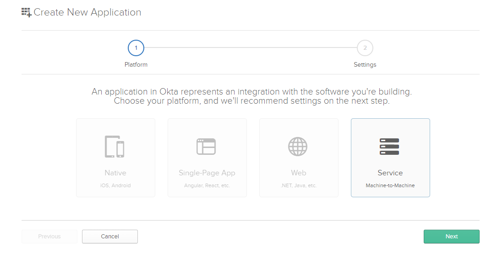
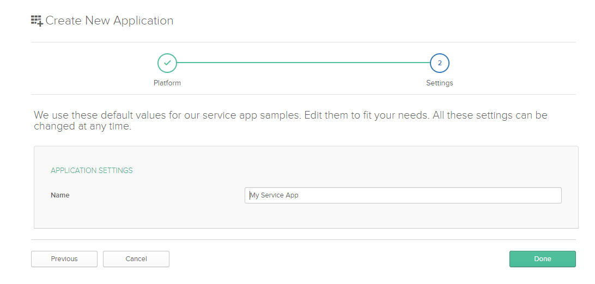

Oauth2の[Client Credentials Grant](https://oauth.net/2/grant-types/client-credentials/)という認証方法があります

サーバー間の通信を行い、また認証したい場合に基本的にUIがないので、  
Client Credentials Grant方式で認証を行うケースが多いです。

例えばリソースサーバーと認証サーバーが分離している場合に、  
リソースサーバーは認証サーバーに問い合わせ、トークンの有効性を確認する必要があります。

今回はこの`トークンの有効性を確認する`という行為をどうやって実現できるかについて紹介します。

## 1 RFC7662

実は、`トークンの有効性を確認する`の規定はすでにRFC7662で定義されています。

有効性をチェックするときのエンドポイントは`/introspect`になります。

いくつかの概念について紹介します

### 1.1 introspect request

リソースサーバーが認証サーバーにイントロスぺクトする際に必要な情報。

| 項目          | 値                                              |
| ------------- | ----------------------------------------------- |
| HTTPメソッド  | POST                                            |
| Content-Type  | application/x-www-form-urlencoded               |
| Authorization | リソースサーバー自身の身分（BearerやBasicなど） |
| Request Body  | token=xxx, token_type_hint=yyy                  |

イントロスぺクトしたいトークンはリクエストボディに入れます。

### 1.2 introspect response

認証サーバーはリクエストを受け付け、確認結果を返します。

#### 1.2.1 response body 

レスポンスボディの各項目について軽く説明します。

| 項目       | 説明                                                         |
| ---------- | ------------------------------------------------------------ |
| active     | **必須**。もしトークンが有効の場合にtrue                     |
| scope      | トークンが利用できるスコープ。https://tools.ietf.org/pdf/rfc6749.pdfのSection 3.3を参照 |
| client_id  | クライアントIDがある場合のみ                                 |
| username   | 人間が読める名前                                             |
| token_type | トークンの種類。https://tools.ietf.org/pdf/rfc6749.pdfのSection 7.1を参照 |
| exp        | トークンのエクスパイアの日時                                 |
| iat        | トークンの発行の日時                                         |
| nbf        | トークンがこの時間前に利用できない                           |
| sub        | トークンの利用目的                                           |
| aud        | トークンの利用対象                                           |
| iss        | トークンの発行者                                             |
| jti        | トークンのユニークID                                         |

基本的にJWT自体の定義が多いので、

もっと知りたい方は[IDトークンが分かれば OpenID Connect が分かる](https://qiita.com/TakahikoKawasaki/items/8f0e422c7edd2d220e06)を読んでください。

#### 1.2.2 エラー処理

もしリソースサーバー自身が提供している認証情報が不正の場合に401を返します。

イントロスぺクト対象のトークンが不正の場合には401ではなく、レスポンスボディのactiveをfalseに設定するのでご注意ください。

## 2 oktaでAuthサーバーを使ってみる

Spring-bootで認証サーバーを実装したいですが、  
Spring-bootの[認証サーバープロジェクト](https://github.com/spring-projects/spring-security-oauth)は非推奨になったので今回は紹介しません。

また、Springチームは[新しい認証サーバー](https://github.com/spring-projects-experimental/spring-authorization-server)のプロジェクトを実装しているので、  
まだ実験プロジェクトとしてインキュベート中です。
興味ある方はご確認ください。

今回は自分で実装する代わりにoktaを利用して認証サーバーを立ち上げます。

まず事前準備としてoktaのアカウントを自分で登録してください。

### 2.1 Application作成

アカウント登録後ログインします。


`Add Application`で新しいアプリケーションを作成します。






作成後に`Client ID`と`Client secret`を確認できます。後でこれらを使います。

### 2.2 APIの設定

ヘッダーのAPI > Authorization Serversをクリックします。今回はdefaultを使います。


スコープタブで新しいスコープを作成します。任意で大丈夫です。


### 2.3 tokenを発行します

ここまでは準備作業が終わったので、実際にトークンを発行してみます。私はpostmanを使っています。


↑は利用例です。各項目について説明します。

| 項目             | 説明                                                         |
| ---------------- | ------------------------------------------------------------ |
| URL              | Authorization ServersタブでIssuer URIを確認できると思います。<br />${Issuer URI}/v1/tokenは今回利用するURLです |
| grant_type       | アプリケーション作成時にマシンツーマシンを選択したので、ここは`client_credentials`になります |
| client_id        | アプリケーションのGeneralタブで確認できます                  |
| client_secret    | アプリケーションのGeneralタブで確認できます                  |
| application_type | service                                                      |
| scope            | スコープタブで追加したスコープ                               |

レスポンスボディの`access_token`は発行されたトークンになります。

これからこのトークンをイントロスぺクトします。

### 2.4 introspectを検証

後でSpringを実装してintrospectを検証しますが、とりあえずpostmanで軽く検証します。


これで先ほど発行されたトークンは有効であることを確認できました。

## 3 Springで実装する

本題に入りますが、https://start.spring.io/にて新しいプロジェクトをダウンロードします。

### 3.1 初期化する


必要なdependencyを追加します。

- Spring Web
- Spring Security
- Oauth2 Resource Server

### 3.2 Authに関する設定

```java
package com.demo.security.config;

import org.springframework.security.config.annotation.web.builders.HttpSecurity;
import org.springframework.security.config.annotation.web.configuration.EnableWebSecurity;
import org.springframework.security.config.annotation.web.configuration.WebSecurityConfigurerAdapter;
import org.springframework.security.config.annotation.web.configurers.oauth2.server.resource.OAuth2ResourceServerConfigurer;

@EnableWebSecurity
public class AuthConfig extends WebSecurityConfigurerAdapter {

    @Override
    protected void configure(HttpSecurity http) throws Exception {
        http.authorizeRequests(
                ar -> ar.antMatchers("/hello").authenticated())
            .oauth2ResourceServer(OAuth2ResourceServerConfigurer::opaqueToken);
    }
}
```

### 3.3 シンプルなコントローラ―

```java
package com.demo.controller;

import org.springframework.web.bind.annotation.GetMapping;
import org.springframework.web.bind.annotation.RestController;

@RestController
public class HelloController {
    @GetMapping("/hello")
    public String hello() {
        return "Hello World";
    }
}
```

### 3.4 application.yml

```yaml
spring:
  security:
    oauth2:
      resourceserver:
        opaquetoken:
          introspection-uri: https://dev-7571110.okta.com/oauth2/default/v1/introspect
          client-id: 0oa13xsm1CsN8v6uq5d6
          client-secret: ****************************
```

### 3.5 pom.xml

下記のdependencyを追加します。

```xml
<dependency>
    <groupId>com.nimbusds</groupId>
    <artifactId>oauth2-oidc-sdk</artifactId>
</dependency>
```

### 3.6 検証

まずSpring-bootを起動します。

```bash
$ mvn spring-boot:run
```


正しくトークンを指定する場合にアクセスできます。

また、トークンが不正の場合に401を返します。

## 参考

https://developer.okta.com/

https://github.com/spring-projects/spring-security

https://tools.ietf.org/html/rfc7662

https://oauth.net/2/grant-types/client-credentials/

https://qiita.com/TakahikoKawasaki/items/8f0e422c7edd2d220e06