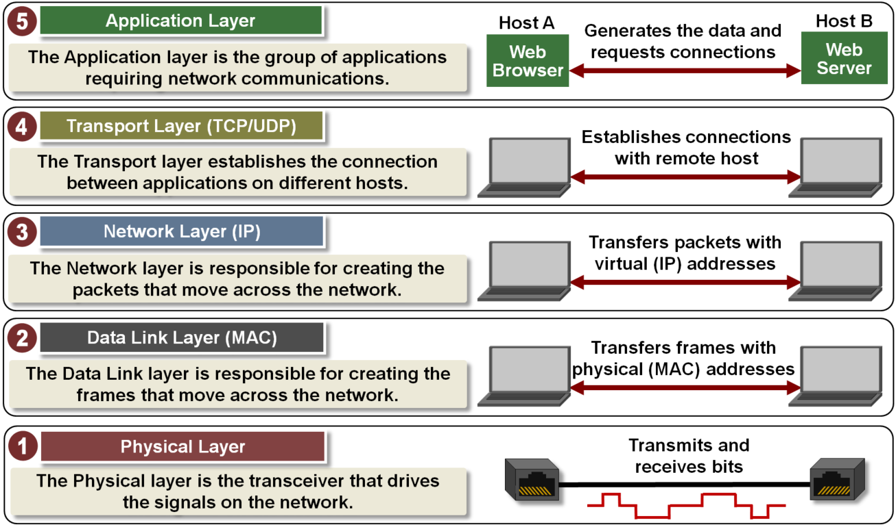
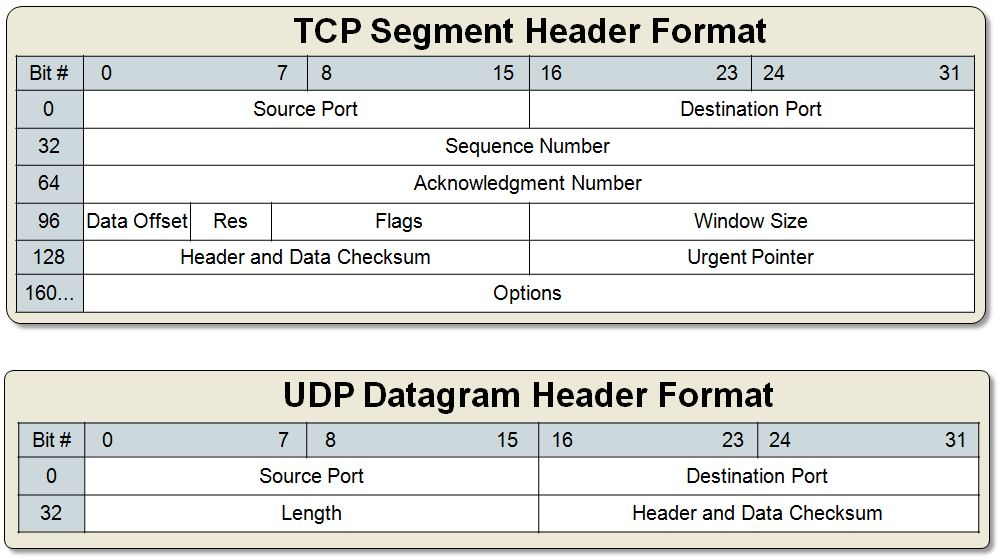

:toc: left

[[overview]]
== 总览

=== TCP/IP五层模型分别有哪五层？

应用层::
  应用层实际上不关注数据是怎么传输的，而是关注数据传输时遵循什么样的格式。 +
  比如HTTP协议提供了服务器间通信时数据必须遵循怎么样的格式，但是HTTP协议并不关心数据通过什么方式传输。
传输层::
  传输层关注的是两个通信端点间如何建立连接，并且给应用层提供服务。 +
  在一台主机上，通过port(端口)来识别不同的应用。
网络层::
  网络层负责打包需要传输的数据，并且在网络中传播数据。 +
  为了识别不同的``端点``，网络层使用IP地址来标识发送和目标地址。
数据链路层::
  数据链路层将网络层的数据包进一步封装，并且在网络中传播数据。 +
  不同于网络层，数据链路层使用MAC地址来识别``节点``。
物理层::
  物理层解析数据链路层传来的数字信号，并且传输数据。



=== 和OSI七层参考模型的区别？

OSI更多的是一个参考模型，而TCP/IP模型则是一个具体的模型且已经被广泛实践。

[[application-layer]]
== 应用层

一个例子，如何发送HTTP请求：
https://colab.research.google.com/drive/1VvXp1HOgs1O8oc2tKt-8RgRBPfKeyDNw

[[application-layer-port]]
=== 端口

应用层通过**端口**来区别不同的应用。
例如常用的应用：

[%header]
|===
|端口 | 应用
|22 | SSH
|80 | HTTP 
|443 | HTTPs
|===

[%hardbreaks]
一台主机最多只能开放2^16^=65535个端口，
对于一些临时的应用，系统会开放一些较大数字号的端口以便应用进行通信。

```sh
$ netstat # 查看TCP/IP通信情况
```

[[transport-layer]]
== 传输层

[%hardbreaks]
*为什么需要传输层？*
首先应用层协商了使用同一个应用的两台主机应该以什么样的格式传递数据，
但是应用层并不关心数据是怎么传输的，
传输这件事是传输层以及它的下层来完成的。



[%header]
|===
|项目 | 解释
|Src/Dest Port | 源端口和目标端口
|Seq No. | 保证了传输数据包的有序性
|Ack No. | 响应TCP报文，将收到的Seq No.加1
|其他 | 省略。。。
|===

```bash
$ ifconfig
$ tcpdump -D # show all interfaces
$ tcpdump -i eth0 -nn # listen to eth0
```

[[transport-layer-hand-shake]]
=== 三次握手和四次分手

[source,log]
----
11:10:48.918942 IP 172.17.0.2.52706 > 192.168.65.1.53: 18007+ A? www.baidu.com. (31)
11:10:48.919005 IP 172.17.0.2.52706 > 192.168.65.1.53: 30805+ AAAA? www.baidu.com. (31)
11:10:48.920740 IP 192.168.65.1.53 > 172.17.0.2.52706: 18007 6/0/0 CNAME www.a.shifen.com., CNAME www.wshifen.com., A 119.63.197.139, A 119.63.197.151, A 119.63.197.139, A 119.63.197.151 (148)
11:10:48.978673 IP 192.168.65.1.53 > 172.17.0.2.52706: 30805 3/0/0 CNAME www.a.shifen.com., CNAME www.wshifen.com., CNAME www.wshifen.com. (98)
11:10:48.978983 IP 172.17.0.2.33446 > 119.63.197.139.80: Flags [S], seq 2715532129, win 64240, options [mss 1460,sackOK,TS val 2148062701 ecr 0,nop,wscale 7], length 0
11:10:48.987961 IP 119.63.197.139.80 > 172.17.0.2.33446: Flags [S.], seq 452909606, ack 2715532130, win 65535, options [mss 1460,wscale 2,eol], length 0
11:10:48.988006 IP 172.17.0.2.33446 > 119.63.197.139.80: Flags [.], ack 1, win 502, length 0
11:10:48.988057 IP 172.17.0.2.33446 > 119.63.197.139.80: Flags [P.], seq 1:78, ack 1, win 502, length 77: HTTP: GET / HTTP/1.1
11:10:48.988770 IP 119.63.197.139.80 > 172.17.0.2.33446: Flags [.], ack 78, win 65535, length 0
11:10:49.065394 IP 119.63.197.139.80 > 172.17.0.2.33446: Flags [P.], seq 1:1449, ack 78, win 65535, length 1448: HTTP: HTTP/1.1 200 OK
11:10:49.065496 IP 172.17.0.2.33446 > 119.63.197.139.80: Flags [.], ack 1449, win 501, length 0
11:10:49.065697 IP 119.63.197.139.80 > 172.17.0.2.33446: Flags [P.], seq 1449:2782, ack 78, win 65535, length 1333: HTTP
11:10:49.065713 IP 172.17.0.2.33446 > 119.63.197.139.80: Flags [.], ack 2782, win 494, length 0
11:10:49.066269 IP 172.17.0.2.33446 > 119.63.197.139.80: Flags [F.], seq 78, ack 2782, win 501, length 0
11:10:49.069270 IP 119.63.197.139.80 > 172.17.0.2.33446: Flags [.], ack 79, win 65535, length 0
11:10:49.076981 IP 119.63.197.139.80 > 172.17.0.2.33446: Flags [F.], seq 2782, ack 79, win 65535, length 0
11:10:49.077061 IP 172.17.0.2.33446 > 119.63.197.139.80: Flags [.], ack 2783, win 501, length 0
----

[[network-layer]]
== 网络层


[%hardbreaks]
*为什么要有网络层？*
传输层虽然定义了如何建立连接，但是具体发给谁，如何定位的问题仍然没有解决。
这份工作是交给网络层和数据链路层来解决的。
可以看到在TCP的报文头里，是没有源和目标地址的。

*IP协议是不可靠的，无连接的数据传输服务。*

不可靠的::
  如果数据包在传输过程中出错，数据包会被简单的丢弃，并发送ICMP给信源。
无连接的::
  IP协议并不会维护连接，因此每个IP报文都是独立的。连接的维护以及报文的顺序应由上层维护，例如TCP协议。

=== 报文详解

.IP报文头
[%header, cols="2,5a"]
|===
|项目 | 解释
|Version | 版本号, ipv4还是ipv6
|IHL | IP头部长度，多少个32bit，32/8=4字节，2^4^=16, 15 * 4 = 60字节，最大长度 
|TotalLength | 报文长度
|Identification | 主机标识，如果在数据链路层被分片，则共享同一标识
|Flags | 分片相关。

* 第二位为1，禁止分片
* 第三位标识更多分片，如果分片的话，最后一个分片为1，其他为0

|Fragment Offset | 分片偏移量
|Time To Live | 报文到达目的地的最大跳数
|Protocol | 上层协议类型
|Header Checksum | 头部校验，检验是否损坏
|Src/Dest IP Addr. | 源和目标地址
|===

报文头后面紧跟的就是实际要传输的数据了。

=== 子网划分和子网掩码

.网络分类
[%header, cols="2,5,3"]
|===
|类别 | 地址范围 | 例子
|A类 | 0.0.0.0到127.255.255.255 | 0 + 网络号(7) + 主机号(24)
|B类 | 128.0.0.0到191.255.255.255 | 10 + 网络号(14) + 主机号(16)
|C类 | 192.0.0.0到223.255.255.255 | 110 + 网络号(21) + 主机号(8)
|D类 | 224.0.0.0到239.255.255.255 | 1110 + 多播组合(28)
|E类 | 240.0.0.0到247.255.255.255 | 11110 + 待用(27)
|===

为什么需要子网划分？::
  传统的划分网络的方式，ABCDE五等级局限性太大，很容易造成划分的浪费。 +
  例如A类的网络，同一子网内可以拥有的主机号过多(2^24^个)，但子网又太少(2^7^个)。 +
  一旦分配完了，A类一共就2^7^个，其他人就没有的用了。

因此，针对这种情况有人提出了新的解决方案，叫做CIDR(Classless Interdomain Routing)


[%hardbreaks]
*概念理解*
IP地址是以**网络号**和**主机号**来识别网络上的主机的。
同一个网络号下的主机才可以互通，不同网络号下的主机要通过网关互联。

那么，为了使同一个网络下可以生成多个子网，就引出了子网掩码的概念。

[%hardbreaks]
*如何使用？*
我们通过占用主机号的位来扩展子网。
例如：
在C类网络中，我们有21为的网络号和8位的主机号，
我们可以从主机号中取出2位，创建2^2^=4个子网。

[example]
[%hardbreaks]
110 + 21位网络号 + 2位子网号 + 6位主机号
子网掩码：11111111 11111111 11111111 11000000
通常写作：192.1.2.3/26 <- 如果主机IP是192.1.2.3的话

[%hardbreaks]
这样做，虽然我们每个子网可分配的主机数从原来的2^8^=254位下降到了2^6^=62位(去除0位和广播位)，
但好处是我们可以自由划分子网，做一些权限控制。
比如上述，我们利用同一个网段划分了四个子网，子网之间的权限控制就可以自由设定了。

=== IP报文如何发送到其他主机？

```sh
$ route
```

```
结果
Kernel IP routing table
Destination     Gateway         Genmask         Flags Metric Ref    Use Iface
default         172.17.0.1      0.0.0.0         UG    0      0        0 eth0
172.17.0.0      0.0.0.0         255.255.0.0     U     0      0        0 eth0
```

[%hardbreaks]
每个主机都会维护一份路由表，
当一个IP报文到达某台主机时，会发生下面的事情：

. 主机接受报文
. 主机查看报文的请求目标地址，
. 如果目标地址就是自己的话，直接解析，交给传输层
. 如果目标地址不是自己的话，则查看路由表转发给下一个节点

[[data-link-layer]]
== 数据链路层

[%hardbreaks]
*为什么需要数据链路层？*
IP协议解决了发给谁的问题，但是实际上IP协议只规定了源地址和目标地址，
要知道从某一个主机A想访问到另一台主机B时，中间是要经过很多台主机的，
那光有A和B的IP地址，显然数据包是没法一次性传过去的。
这里就引入了数据链路层的概念。

image::images/network.svg[]

=== ARP / 地址解析协议

[horizontal]
ARP缓存:: 保存了IP和MAC地址的映射
广播:: 发送数据给所有节点，收到广播的节点也会继续发送给它的所有节点， +
广播为ffff.ffff.ffff, 或者说255.255.255.255

*详细传播过程*

. 主机A发送数据帧给交换机(数据链路层的基本单元为帧)
. 交换机接收数据帧(一般主机只与一台交换机连接)
. 两种情况
.. 交换机解析IP地址，如果匹配成功(找到对应的MAC地址)，则发送给相应的端口
.. 如果匹配失败，则挂起本次传输，先进行一次广播
... 广播的目的：找到目标IP的MAC地址
. 层层转发之后，主机B收到了数据帧，解析后匹配为自己的IP，进行处理

*广播的过程*

* 当主机不包含目标IP对应的MAC地址时会触发一次广播。
* 主机A会先发送一个广播，包含信息：我是谁(src IP, src MAC)，我想要找谁(dest IP)，以及它的位置(dest MAC)。
* 网络中的节点会解析此广播，如果不是自己的IP，则直接丢弃
* 如果某主机B命中，则会**单播**回给主机A告诉自己的MAC地址。

这样就完成了IP到MAC的映射。

[%hardbreaks]
*一台交换机连了很多设备，他即使拥有ARP缓存，他又怎么知道往哪个设备发送数据呢？*
实际上在广播的过程中，交换机会记录下数据帧的流向，
比如主机A广播的时候，是从交换机的1口进来的，那么交换机就知道主机A在他的1口，
同理主机B的单播从交换机的2口进来时，交换机以后就知道如果要发给主机B，则需要将数据发送到2口。

```sh
$ arp -na # 查看arp缓存
```

```sh
# memo, add new point
$ docker run -itd ubuntu --name local-ubuntu-3
$ docker network connect localNetwork lcal-ubuntu-3
```

[[physical-layer]]
== 物理层

*介质*

* 双绞线
* 光纤
* wifi

其他的不懂。太复杂。


